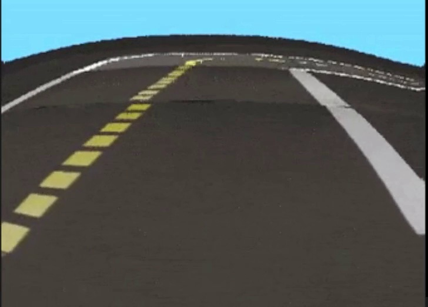
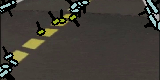

# dt-demos-cps

## Demonstrations

### 1. __Joystick Driving__

Using a gamepad joystick controller, move the Duckiebot around. Only the minimal
amount of packages required are used. 

On the duckiebot,

```bash
ros2 launch dt_demos simple_joystick_driving.launch.xml
```

On your computer/duckiebot where your game controller is attached to, run

```bash
ros2 launch dt-joystick joystick_node.launch.xml veh:=<robot name>
```

Requires the `joy` package that can be found in the [joystick_drivers](https://github.com/ros-drivers/joystick_drivers) repository. It should be part of the default ROS2 installation.

Double check that the `joy` topic is remapped so that the `joy_mapper_node` receives the published messages.

### 2. __Keyboard Control__
Send commands to the duckiebot using a keyboard.

On the duckiebot,

```bash
ros2 launch wheels_driver wheels_driver_node.launch.xml veh:=<robot name>
```

On your computer,

```bash
ros2 run dt_demo_keyboard keyboard_control_node --ros-args -p veh:=<robot name>

# You should see the following printed out:

# This node takes key presses from the keyboard and publishes them as WheelsCmdStamped and BoolStamped messages. It works best with a US keyboard layout.
# ---------------------------
# Moving around:
#         w
#    a    s    d
#    z    x
# e : increase velocity
# q : decrease velocity
# x : stop
# z : (activate/deactivate) emergency stop
# CTRL-C to quit
```

### 3. __Lane Following__

On the duckiebot:

```bash
ros2 launch dt_demos lane_following.launch.xml
```

Start the lane following by running on your computer:

```bash
ros2 run dt_demo_keyboard lane_following_control_node --ros-args -p veh:=<robot name>

# You should see the following printed out:

# Start and stop lane following on the Duckiebot.
# ---------------------------
# a : Start lane following
# s : Stop lane following
# CTRL-C to quit
```

Visualize the lane detection video stream using `rqt_image_view`.

### 4. __Vision Pipeline__

Similar to the `lane_following` demo, but without any of the hardware. Optionally, use a video streamer to minic the actual camera on the Duckiebot. For example,

```bash
ros2 launch dt_demos vision_pipeline.launch.xml

# To stream image or video
ros2 launch dt_demos vision_pipeline.launch.xml use_fake_camera:=true src_type:=<'image' or 'video'> src_path:=<path to file>
```

<p float="left">
  
   
  
</p>


## Credits

* https://github.com/duckietown/dt-core/tree/daffy/packages/duckietown_demos
