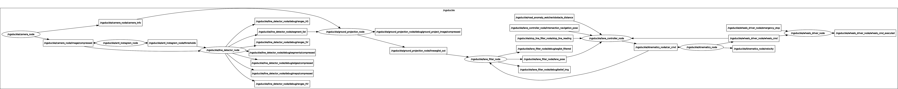
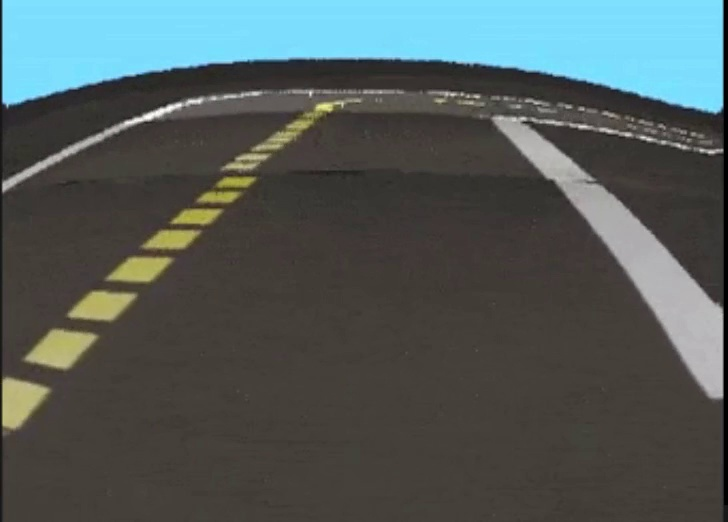
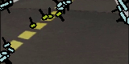

# dt-demos-cps

## Demonstrations

### 1. __simple_joystick_driving__

Using a gamepad joystick controller, move the Duckiebot around. Only the minimal
amount of packages required are used. 

On the duckiebot,

```bash
ros2 launch dt_demos simple_joystick_driving.launch.xml
```

On your computer/duckiebot where your game controller is attached to, run

```bash
ros2 launch dt-joystick joystick_node.launch.xml veh:=<robot name>
```

Requires the `joy` package that can be found in the [joystick_drivers](https://github.com/ros-drivers/joystick_drivers) repository. It should be part of the default ROS2 installation.

Double check that the `joy` topic is remapped so that the `joy_mapper_node` receives the published messages. 

### 2. __lane_following__

On the duckiebot:

```bash
ros2 launch dt_demos lane_following.launch.xml
```

Visualize the lane detection video stream using `rqt_image_view`.

Below shows the nodes and topics



### 3. __generic_lane_following__

>_To Be Completed_

A simpler lane following demo that works on two lane markings. Unlike the full lane following demo, the lane markings can be any color as the lane detection is done in grayscale. Based off [here](https://towardsdatascience.com/deeppicar-part-4-lane-following-via-opencv-737dd9e47c96) and [here](https://medium.com/@SunEdition/lane-detection-and-turn-prediction-algorithm-for-autonomous-vehicles-6423f77dc841).

### 4. __vision_pipeline__

Similar to the `lane_following` demo, but without any of the hardware. Only uses the computer vision nodes, with a video streamer to minic the actual camera. For example,

```bash
ros2 launch dt_demos vision_pipeline.launch.xml src_type:=<image or video> src_path:=<path to file>
```

<p float="left">
  
   
  
</p>


### 5. __generic_vision_pipeline__

Similar to the `generic_lane_following` demo, but without any of the hardware. Only uses the computer vision nodes, with a video streamer to minic the actual camera. For example,

```bash
ros2 launch dt_demos generic_vision_pipeline.launch.xml src_type:=<image or video> src_path:=<path to file>
```

## Credits

* https://github.com/duckietown/dt-core/tree/daffy/packages/duckietown_demos
